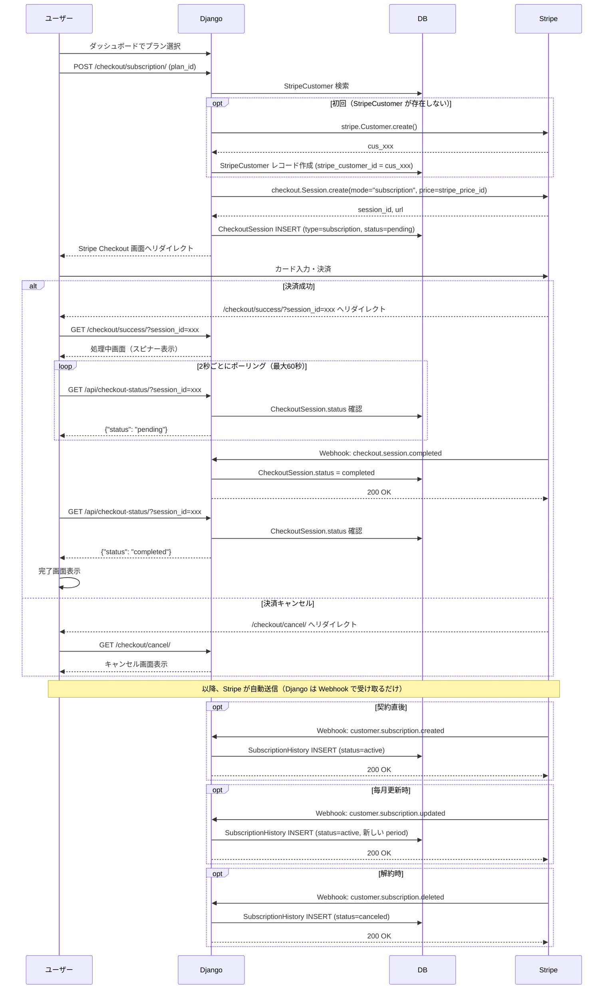
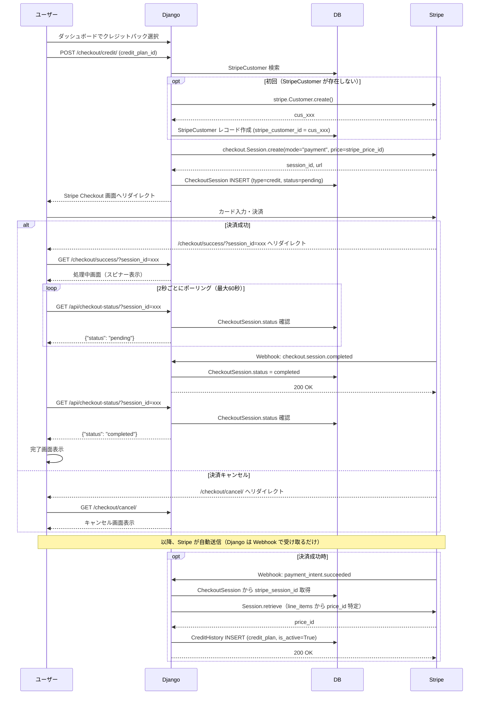
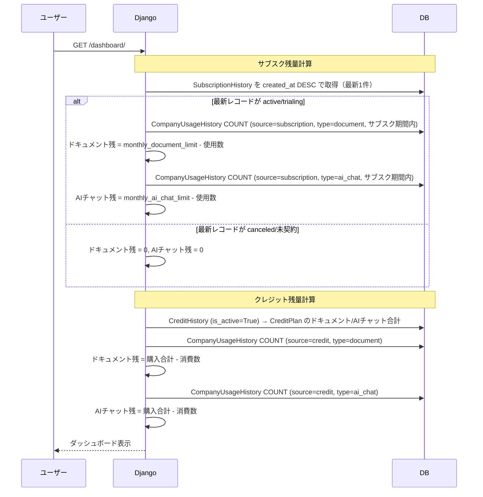

# Stripe決済フロー

## サブスクリプション契約

## クレジット購入

## 残量計算

## エンドポイント

| URL | メソッド | 説明 |
|-----|---------|------|
| /login/ | GET/POST | ログイン画面 |
| /logout/ | GET | ログアウト |
| /dashboard/ | GET | ダッシュボード（残量表示・プラン変更・クレジット購入） |
| /checkout/subscription/ | POST | サブスク Checkout 開始 |
| /checkout/credit/ | POST | クレジット Checkout 開始 |
| /checkout/success/ | GET | 決済処理中画面（ポーリング） |
| /checkout/cancel/ | GET | 決済キャンセル画面 |
| /api/checkout-status/ | GET | CheckoutSession ステータス確認 API |
| /webhook/ | POST | Stripe Webhook 受信（対象イベント: `checkout.session.completed`, `customer.subscription.created`, `customer.subscription.updated`, `customer.subscription.deleted`, `payment_intent.succeeded`） |
