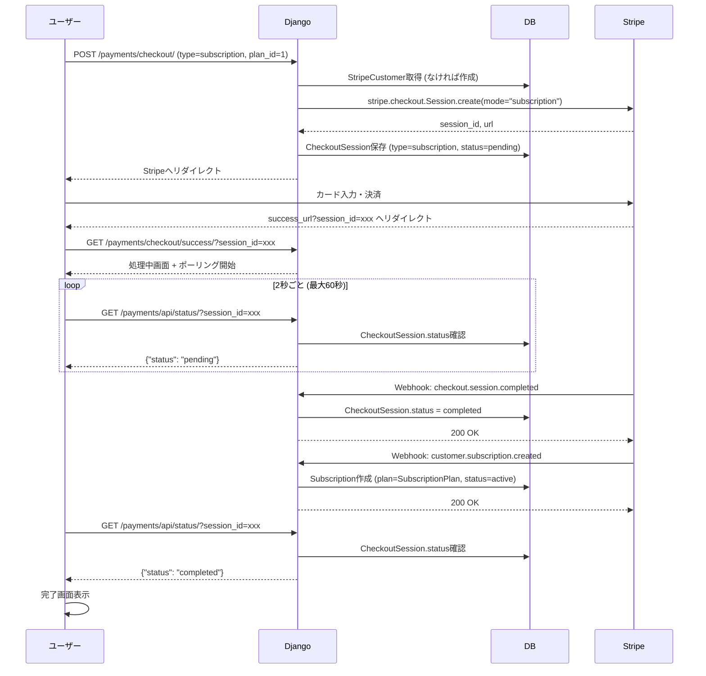
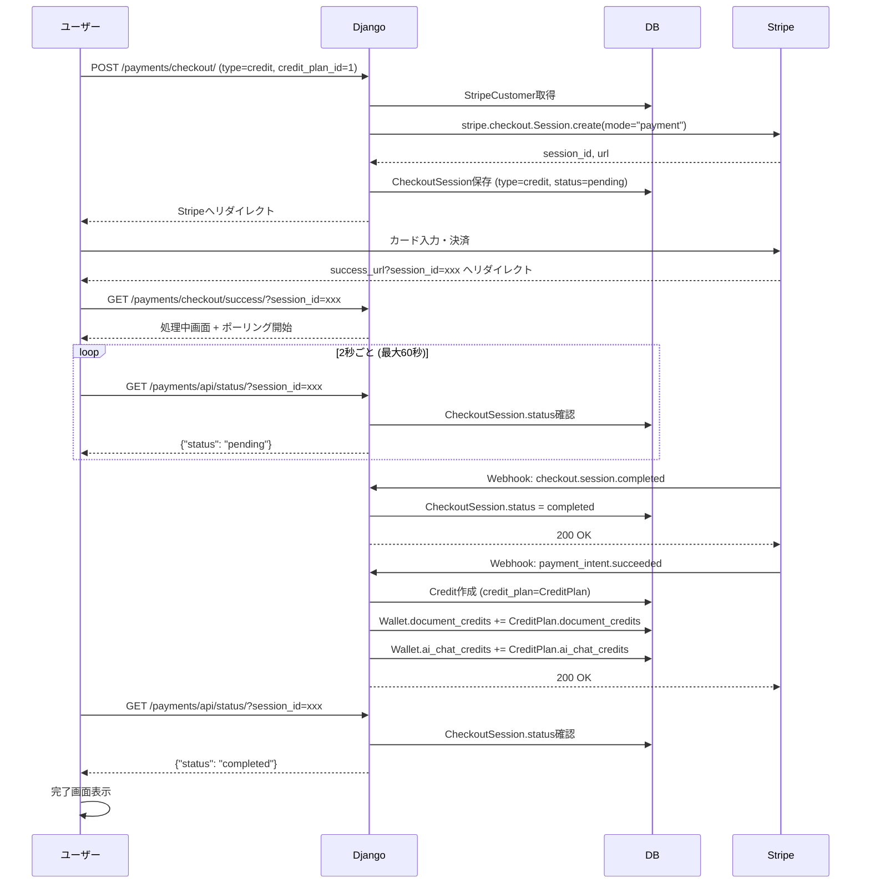

# Stripe決済フロー

## サブスクリプション契約

## クレジット購入

## フローの違い

| | サブスクリプション | クレジット購入 |
|---|---|---|
| Checkout mode | `subscription` | `payment` |
| CheckoutSession.type | `subscription` | `credit` |
| Webhook | `customer.subscription.created` | `payment_intent.succeeded` |
| DB処理 | Subscription作成 | Credit作成 + Wallet加算 |

## エンドポイント

| URL | メソッド | 説明 |
|-----|---------|------|
| /payments/checkout/ | POST | Checkout開始 |
| /payments/checkout/success/ | GET | 成功画面 |
| /payments/checkout/cancel/ | GET | キャンセル画面 |
| /payments/api/status/ | GET | 状態確認API |
| /payments/webhook/ | POST | Stripe Webhook |
| /payments/billing-portal/ | GET | 顧客ポータル |
