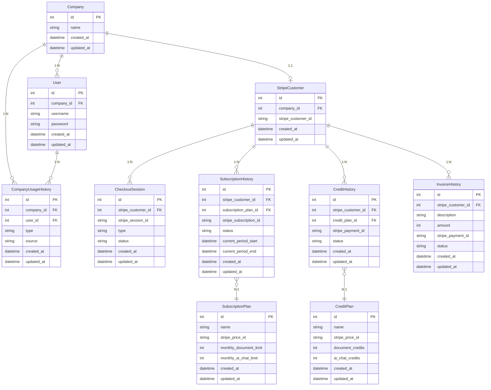

# 決済機能 ER図

## テーブル責務

| テーブル | 責務 | 状態管理 |
|---------|------|---------|
| User | ユーザー（Django AbstractUser拡張、Companyに所属） | - |
| Company | 会社情報 | - |
| StripeCustomer | Stripe顧客紐付け | - |
| CompanyUsageHistory | 使用履歴（type: document/ai_chat、source: subscription/credit） | - |
| CheckoutSession | 決済セッション追跡（ポーリング用） | pending → completed |
| SubscriptionHistory | サブスク契約（1 subscription_id = 1レコード、UPDATE） | created → updated → deleted |
| SubscriptionPlan | 月額プラン定義（静的マスタ） | - |
| CreditHistory | クレジット購入（1 payment_id = 1レコード、UPDATE） | completed → refunded |
| CreditPlan | クレジットパック定義（静的マスタ） | - |
| InvoiceHistory | カスタム支払い（1 payment_id = 1レコード、UPDATE） | completed → refunded |
