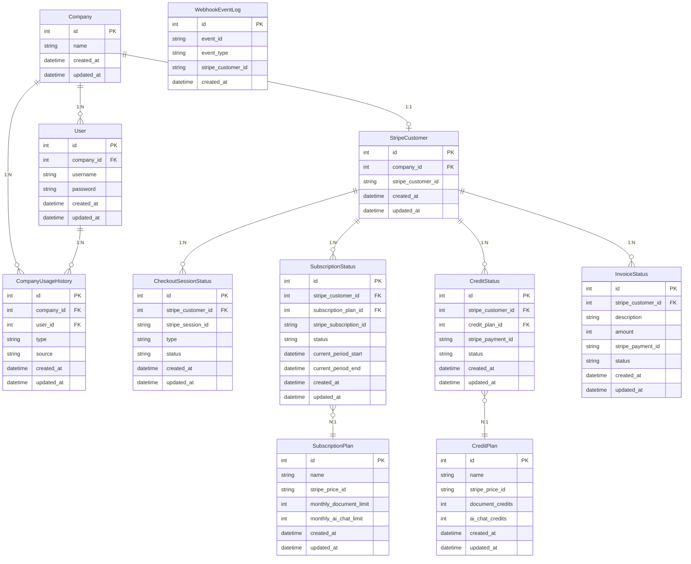

# 決済機能 ER図

```mermaid
erDiagram
    Company ||--o{ User : "1:N"
    Company ||--o| StripeCustomer : "1:1"
    Company ||--o{ CompanyUsageHistory : "1:N"
    User ||--o{ CompanyUsageHistory : "1:N"
    StripeCustomer ||--o{ CheckoutSessionStatus : "1:N"
    StripeCustomer ||--o{ SubscriptionStatus : "1:N"
    SubscriptionStatus }o--|| SubscriptionPlan : "N:1"
    StripeCustomer ||--o{ CreditStatus : "1:N"
    CreditStatus }o--|| CreditPlan : "N:1"
    StripeCustomer ||--o{ InvoiceStatus : "1:N"

    User {
        int id PK
        int company_id FK
        string username
        string password
        datetime created_at
        datetime updated_at
    }

    Company {
        int id PK
        string name
        datetime created_at
        datetime updated_at
    }

    StripeCustomer {
        int id PK
        int company_id FK
        string stripe_customer_id
        datetime created_at
        datetime updated_at
    }

    CompanyUsageHistory {
        int id PK
        int company_id FK
        int user_id FK
        string type
        string source
        datetime created_at
        datetime updated_at
    }

    CheckoutSessionStatus {
        int id PK
        int stripe_customer_id FK
        string stripe_session_id
        string type
        string status
        datetime created_at
        datetime updated_at
    }

    SubscriptionStatus {
        int id PK
        int stripe_customer_id FK
        int subscription_plan_id FK
        string stripe_subscription_id
        string status
        datetime current_period_start
        datetime current_period_end
        datetime created_at
        datetime updated_at
    }

    SubscriptionPlan {
        int id PK
        string name
        string stripe_price_id
        int monthly_document_limit
        int monthly_ai_chat_limit
        datetime created_at
        datetime updated_at
    }

    CreditStatus {
        int id PK
        int stripe_customer_id FK
        int credit_plan_id FK
        string stripe_payment_id
        string status
        datetime created_at
        datetime updated_at
    }

    CreditPlan {
        int id PK
        string name
        string stripe_price_id
        int document_credits
        int ai_chat_credits
        datetime created_at
        datetime updated_at
    }

    InvoiceStatus {
        int id PK
        int stripe_customer_id FK
        string description
        int amount
        string stripe_payment_id
        string status
        datetime created_at
        datetime updated_at
    }

    WebhookEventLog {
        int id PK
        string event_id
        string event_type
        string stripe_customer_id
        datetime created_at
    }
```

## テーブル責務

| テーブル | 責務 | 状態管理 |
|---------|------|---------|
| User | ユーザー（Django AbstractUser拡張、Companyに所属） | - |
| Company | 会社情報 | - |
| StripeCustomer | Stripe顧客紐付け | - |
| CompanyUsageHistory | 使用履歴（type: document/ai_chat、source: subscription/credit） | INSERT only |
| CheckoutSessionStatus | 決済セッション状態追跡（ポーリング用） | pending → completed |
| SubscriptionStatus | サブスク契約状態（1 subscription_id = 1レコード、UPDATE） | created → updated → deleted |
| SubscriptionPlan | 月額プラン定義（静的マスタ） | - |
| CreditStatus | クレジット購入状態（1 payment_id = 1レコード、UPDATE） | completed → refunded |
| CreditPlan | クレジットパック定義（静的マスタ） | - |
| InvoiceStatus | カスタム支払い状態（1 payment_id = 1レコード、UPDATE） | completed → refunded |
| WebhookEventLog | Webhookイベントログ（冪等性管理） | INSERT only |
