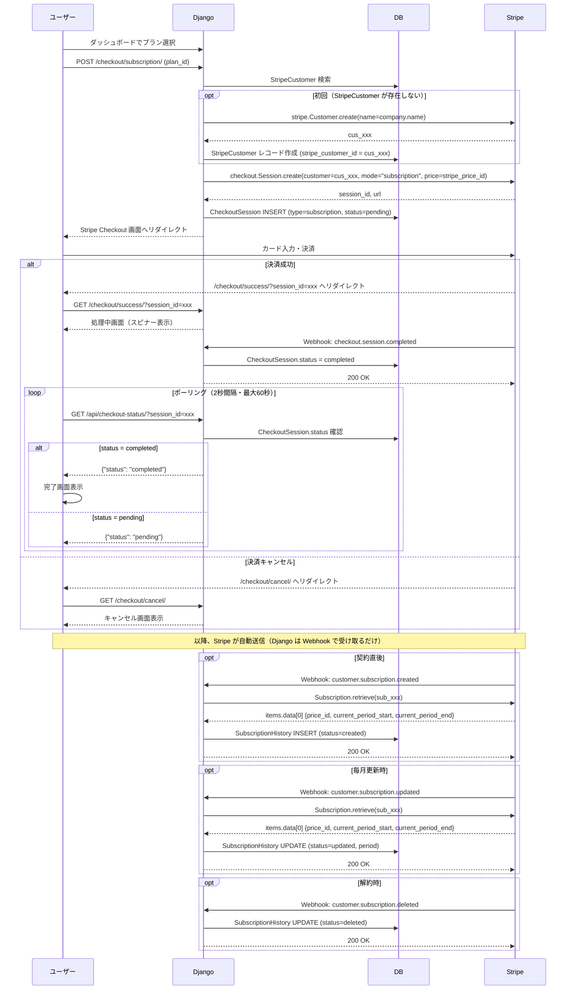
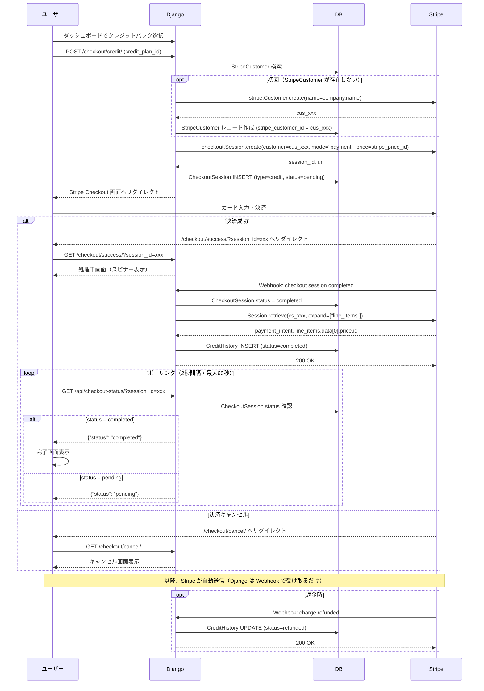
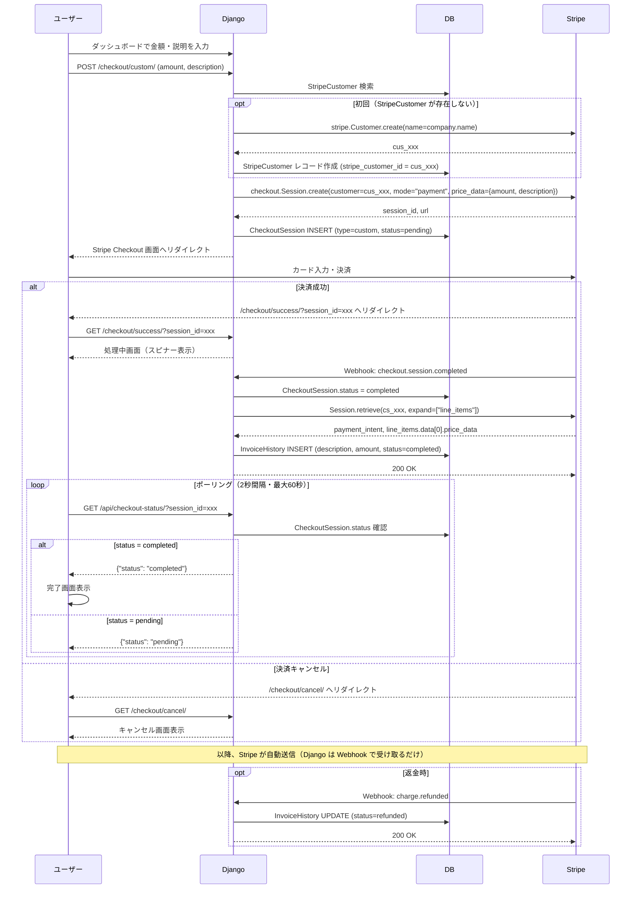
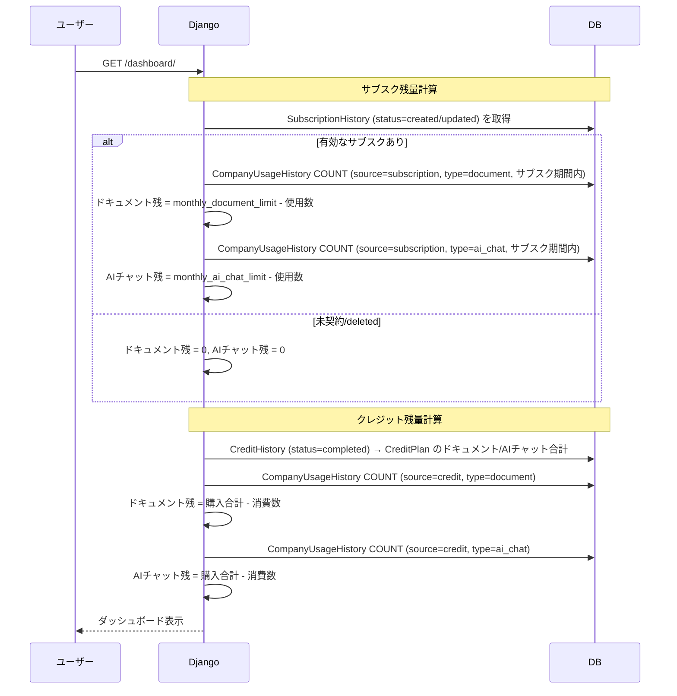

# Stripe決済フロー

## サブスクリプション契約

```mermaid
sequenceDiagram
    participant U as ユーザー
    participant D as Django
    participant DB as DB
    participant S as Stripe

    U->>D: ダッシュボードでプラン選択
    U->>D: POST /checkout/subscription/ (plan_id)

    D->>DB: StripeCustomer 検索

    opt 初回（StripeCustomer が存在しない）
        D->>S: stripe.Customer.create(name=company.name)
        S-->>D: cus_xxx
        D->>DB: StripeCustomer レコード作成 (stripe_customer_id = cus_xxx)
    end

    D->>S: checkout.Session.create(customer=cus_xxx, mode="subscription", price=stripe_price_id)
    S-->>D: session_id, url
    D->>DB: CheckoutSession INSERT (type=subscription, status=pending)
    D-->>U: Stripe Checkout 画面へリダイレクト

    U->>S: カード入力・決済

    alt 決済成功
        S-->>U: /checkout/success/?session_id=xxx へリダイレクト
        U->>D: GET /checkout/success/?session_id=xxx
        D-->>U: 処理中画面（スピナー表示）

        S->>D: Webhook: checkout.session.completed
        D->>DB: CheckoutSession.status = completed
        D-->>S: 200 OK

        loop ポーリング（2秒間隔・最大60秒）
            U->>D: GET /api/checkout-status/?session_id=xxx
            D->>DB: CheckoutSession.status 確認
            alt status = completed
                D-->>U: {"status": "completed"}
                U->>U: 完了画面表示
            else status = pending
                D-->>U: {"status": "pending"}
            end
        end

    else 決済キャンセル
        S-->>U: /checkout/cancel/ へリダイレクト
        U->>D: GET /checkout/cancel/
        D-->>U: キャンセル画面表示
    end

    Note over U,S: 以降、Stripe が自動送信（Django は Webhook で受け取るだけ）

    opt 契約直後
        S->>D: Webhook: customer.subscription.created
        D->>S: Subscription.retrieve(sub_xxx)
        S-->>D: items.data[0] {price_id, current_period_start, current_period_end}
        D->>DB: SubscriptionHistory INSERT (status=created)
        D-->>S: 200 OK
    end

    opt 毎月更新時
        S->>D: Webhook: customer.subscription.updated
        D->>S: Subscription.retrieve(sub_xxx)
        S-->>D: items.data[0] {price_id, current_period_start, current_period_end}
        D->>DB: SubscriptionHistory UPDATE (status=updated, period)
        D-->>S: 200 OK
    end

    opt 解約時
        S->>D: Webhook: customer.subscription.deleted
        D->>DB: SubscriptionHistory UPDATE (status=deleted)
        D-->>S: 200 OK
    end
```

## クレジット購入

```mermaid
sequenceDiagram
    participant U as ユーザー
    participant D as Django
    participant DB as DB
    participant S as Stripe

    U->>D: ダッシュボードでクレジットパック選択
    U->>D: POST /checkout/credit/ (credit_plan_id)

    D->>DB: StripeCustomer 検索

    opt 初回（StripeCustomer が存在しない）
        D->>S: stripe.Customer.create(name=company.name)
        S-->>D: cus_xxx
        D->>DB: StripeCustomer レコード作成 (stripe_customer_id = cus_xxx)
    end

    D->>S: checkout.Session.create(customer=cus_xxx, mode="payment", price=stripe_price_id)
    S-->>D: session_id, url
    D->>DB: CheckoutSession INSERT (type=credit, status=pending)
    D-->>U: Stripe Checkout 画面へリダイレクト

    U->>S: カード入力・決済

    alt 決済成功
        S-->>U: /checkout/success/?session_id=xxx へリダイレクト
        U->>D: GET /checkout/success/?session_id=xxx
        D-->>U: 処理中画面（スピナー表示）

        S->>D: Webhook: checkout.session.completed
        D->>DB: CheckoutSession.status = completed
        D->>S: Session.retrieve(cs_xxx, expand=["line_items"])
        S-->>D: payment_intent, line_items.data[0].price.id
        D->>DB: CreditHistory INSERT (status=completed)
        D-->>S: 200 OK

        loop ポーリング（2秒間隔・最大60秒）
            U->>D: GET /api/checkout-status/?session_id=xxx
            D->>DB: CheckoutSession.status 確認
            alt status = completed
                D-->>U: {"status": "completed"}
                U->>U: 完了画面表示
            else status = pending
                D-->>U: {"status": "pending"}
            end
        end

    else 決済キャンセル
        S-->>U: /checkout/cancel/ へリダイレクト
        U->>D: GET /checkout/cancel/
        D-->>U: キャンセル画面表示
    end

    Note over U,S: 以降、Stripe が自動送信（Django は Webhook で受け取るだけ）

    opt 返金時
        S->>D: Webhook: charge.refunded
        D->>DB: CreditHistory UPDATE (status=refunded)
        D-->>S: 200 OK
    end
```

## カスタム支払い

```mermaid
sequenceDiagram
    participant U as ユーザー
    participant D as Django
    participant DB as DB
    participant S as Stripe

    U->>D: ダッシュボードで金額・説明を入力
    U->>D: POST /checkout/custom/ (amount, description)

    D->>DB: StripeCustomer 検索

    opt 初回（StripeCustomer が存在しない）
        D->>S: stripe.Customer.create(name=company.name)
        S-->>D: cus_xxx
        D->>DB: StripeCustomer レコード作成 (stripe_customer_id = cus_xxx)
    end

    D->>S: checkout.Session.create(customer=cus_xxx, mode="payment", price_data={amount, description})
    S-->>D: session_id, url
    D->>DB: CheckoutSession INSERT (type=custom, status=pending)
    D-->>U: Stripe Checkout 画面へリダイレクト

    U->>S: カード入力・決済

    alt 決済成功
        S-->>U: /checkout/success/?session_id=xxx へリダイレクト
        U->>D: GET /checkout/success/?session_id=xxx
        D-->>U: 処理中画面（スピナー表示）

        S->>D: Webhook: checkout.session.completed
        D->>DB: CheckoutSession.status = completed
        D->>S: Session.retrieve(cs_xxx, expand=["line_items"])
        S-->>D: payment_intent, line_items.data[0].price_data
        D->>DB: InvoiceHistory INSERT (description, amount, status=completed)
        D-->>S: 200 OK

        loop ポーリング（2秒間隔・最大60秒）
            U->>D: GET /api/checkout-status/?session_id=xxx
            D->>DB: CheckoutSession.status 確認
            alt status = completed
                D-->>U: {"status": "completed"}
                U->>U: 完了画面表示
            else status = pending
                D-->>U: {"status": "pending"}
            end
        end

    else 決済キャンセル
        S-->>U: /checkout/cancel/ へリダイレクト
        U->>D: GET /checkout/cancel/
        D-->>U: キャンセル画面表示
    end

    Note over U,S: 以降、Stripe が自動送信（Django は Webhook で受け取るだけ）

    opt 返金時
        S->>D: Webhook: charge.refunded
        D->>DB: InvoiceHistory UPDATE (status=refunded)
        D-->>S: 200 OK
    end
```

## 残量計算

```mermaid
sequenceDiagram
    participant U as ユーザー
    participant D as Django
    participant DB as DB

    U->>D: GET /dashboard/

    Note over D,DB: サブスク残量計算

    D->>DB: SubscriptionHistory (status=created/updated) を取得
    alt 有効なサブスクあり
        D->>DB: CompanyUsageHistory COUNT (source=subscription, type=document, サブスク期間内)
        D->>D: ドキュメント残 = monthly_document_limit - 使用数
        D->>DB: CompanyUsageHistory COUNT (source=subscription, type=ai_chat, サブスク期間内)
        D->>D: AIチャット残 = monthly_ai_chat_limit - 使用数
    else 未契約/deleted
        D->>D: ドキュメント残 = 0, AIチャット残 = 0
    end

    Note over D,DB: クレジット残量計算

    D->>DB: CreditHistory (status=completed) → CreditPlan のドキュメント/AIチャット合計
    D->>DB: CompanyUsageHistory COUNT (source=credit, type=document)
    D->>D: ドキュメント残 = 購入合計 - 消費数
    D->>DB: CompanyUsageHistory COUNT (source=credit, type=ai_chat)
    D->>D: AIチャット残 = 購入合計 - 消費数

    D-->>U: ダッシュボード表示
```
