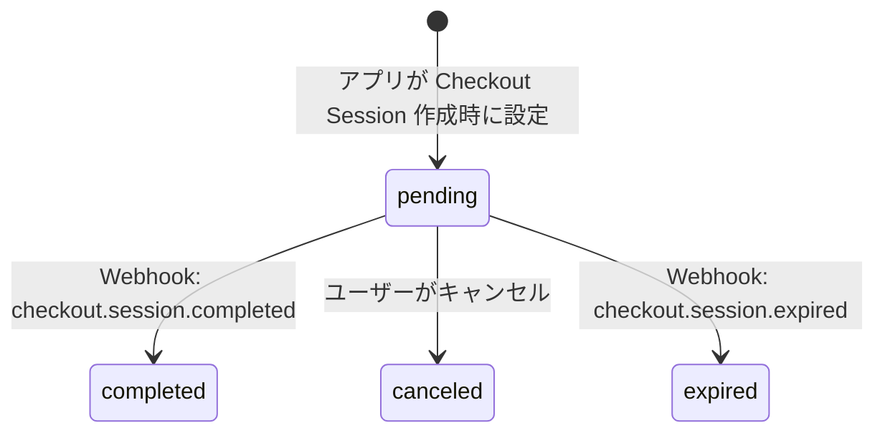
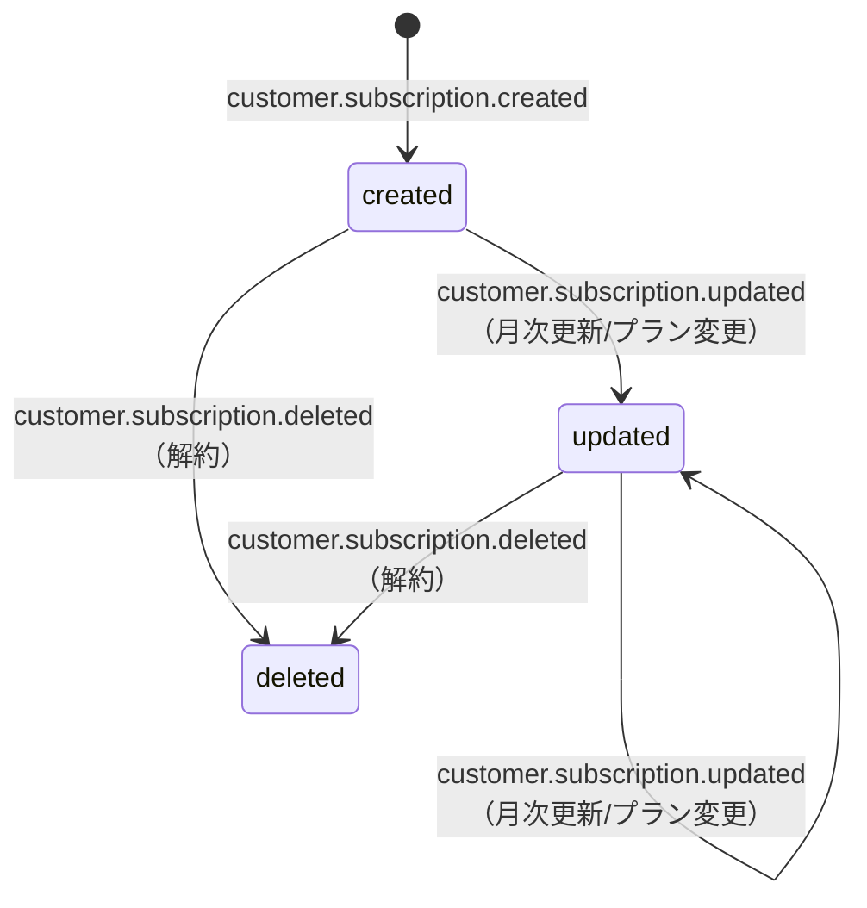
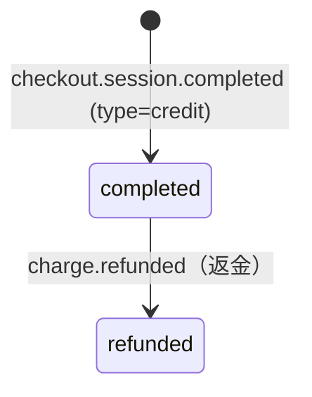
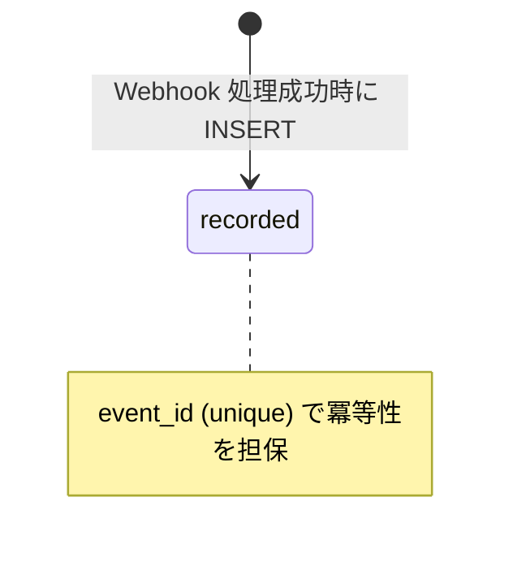

# ステータス状態遷移図

## CheckoutSessionStatus

```mermaid
stateDiagram-v2
    [*] --> pending: アプリが Checkout Session 作成時に設定
    pending --> completed: Webhook: checkout.session.completed
    pending --> canceled: ユーザーがキャンセル
    pending --> expired: Webhook: checkout.session.expired
```

## SubscriptionStatus

```mermaid
stateDiagram-v2
    [*] --> created: customer.subscription.created
    created --> updated: customer.subscription.updated（月次更新/プラン変更）
    updated --> updated: customer.subscription.updated（月次更新/プラン変更）
    created --> deleted: customer.subscription.deleted（解約）
    updated --> deleted: customer.subscription.deleted（解約）
```

## CreditStatus

```mermaid
stateDiagram-v2
    [*] --> completed: checkout.session.completed (type=credit)
    completed --> refunded: charge.refunded（返金）
```

## InvoiceStatus

```mermaid
stateDiagram-v2
    [*] --> completed: checkout.session.completed (type=custom)
    completed --> refunded: charge.refunded（返金）
```

## WebhookEventLog

```mermaid
stateDiagram-v2
    [*] --> recorded: Webhook 処理成功時に INSERT
    note right of recorded: event_id (unique) で冪等性を担保
```
