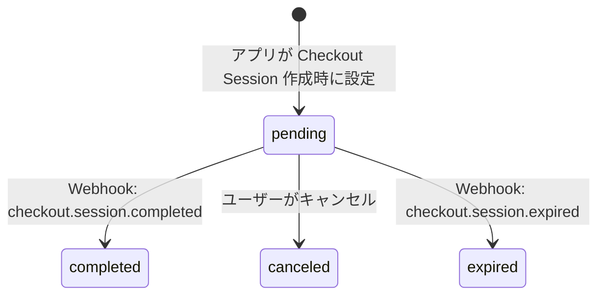
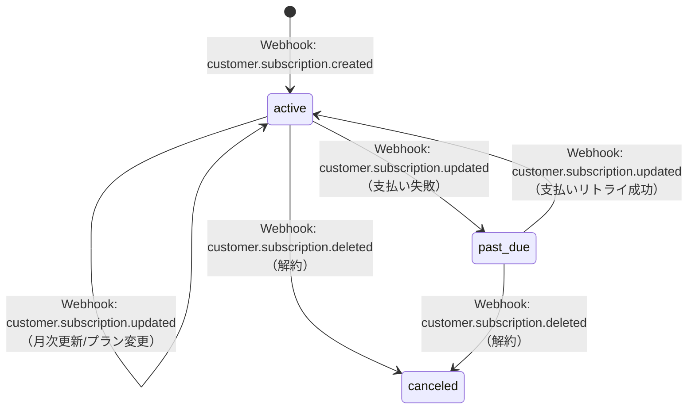
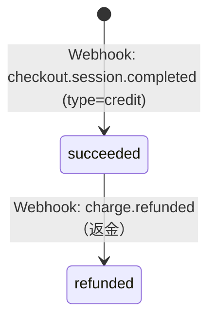
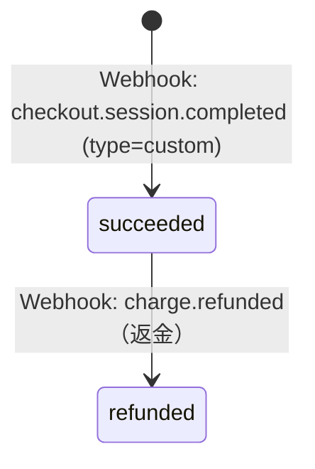
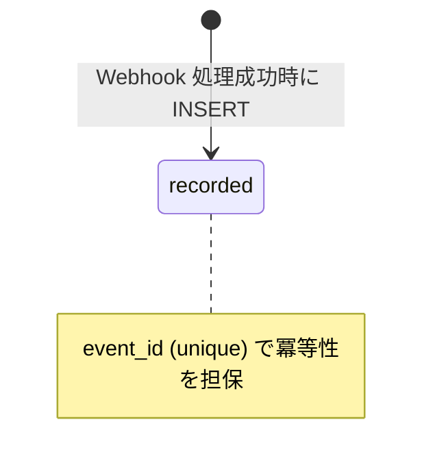

# ステータス状態遷移図

## CheckoutSessionStatus

## SubscriptionStatus

## CreditStatus

## InvoiceStatus

## WebhookEventLog

## ステータスと Webhook の対応表

| テーブル | status | 対応する Webhook |
|---------|--------|-----------------|
| SubscriptionStatus | active | customer.subscription.created / customer.subscription.updated |
| SubscriptionStatus | past_due | customer.subscription.updated（支払い失敗） |
| SubscriptionStatus | canceled | customer.subscription.deleted |
| CreditStatus | succeeded | checkout.session.completed (type=credit) |
| CreditStatus | refunded | charge.refunded |
| InvoiceStatus | succeeded | checkout.session.completed (type=custom) |
| InvoiceStatus | refunded | charge.refunded |
| CheckoutSessionStatus | pending | アプリが設定 |
| CheckoutSessionStatus | completed | checkout.session.completed |
| CheckoutSessionStatus | canceled | ユーザーがキャンセル |
| CheckoutSessionStatus | expired | checkout.session.expired |
