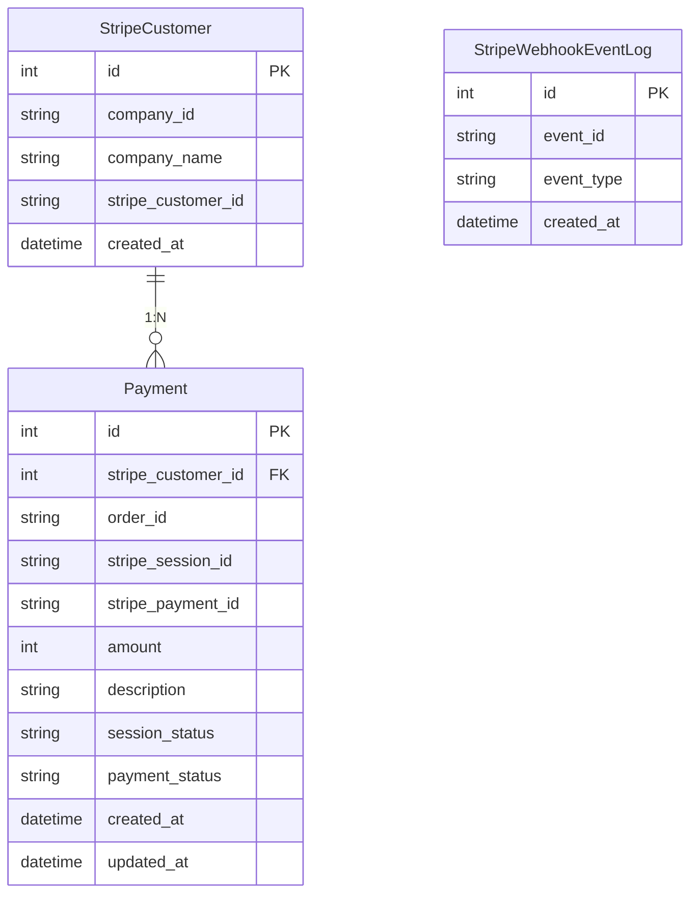

# 決済機能 ER図

## テーブル責務

| テーブル | 責務 | 状態管理 |
|---------|------|---------|
| StripeCustomer | 外部 company_id ↔ Stripe Customer 紐付け（1社1レコード） | - |
| Payment | Checkout Session の lifecycle と決済結果を1テーブルで表現 | session: pending → completed / canceled / expired payment: unpaid → succeeded / refunded |
| StripeWebhookEventLog | Webhook 受信の冪等性管理（event_id unique） | INSERT only |
