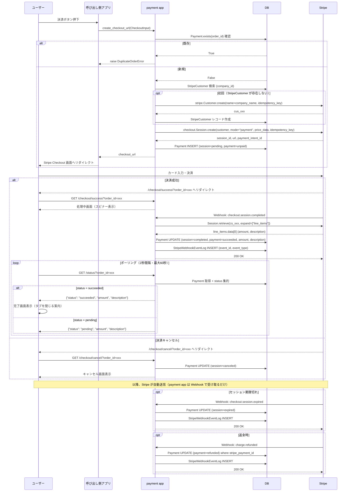
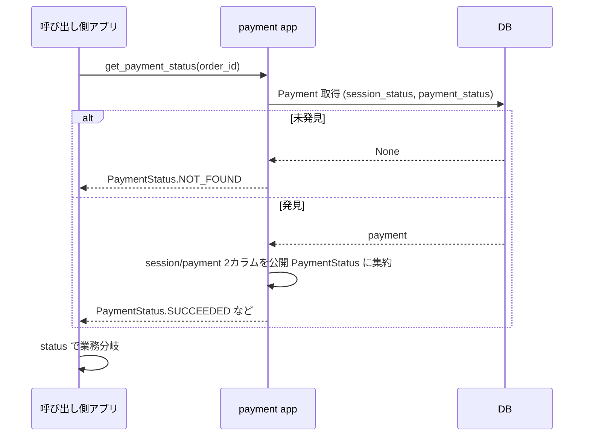

# Stripe 決済フロー

## 自由金額決済

```mermaid
sequenceDiagram
    participant U as ユーザー
    participant C as 呼び出し側アプリ
    participant D as payment app
    participant DB as DB
    participant S as Stripe

    U->>C: 決済ボタン押下
    C->>D: create_checkout_url(CheckoutInput)

    D->>DB: Payment.exists(order_id) 確認
    alt 既存
        DB-->>D: True
        D-->>C: raise DuplicateOrderError
    else 新規
        DB-->>D: False
        D->>DB: StripeCustomer 検索 (company_id)

        opt 初回（StripeCustomer が存在しない）
            D->>S: stripe.Customer.create(name=company_name, idempotency_key)
            S-->>D: cus_xxx
            D->>DB: StripeCustomer レコード作成
        end

        D->>S: checkout.Session.create(customer, mode="payment", price_data, idempotency_key)
        S-->>D: session_id, url, payment_intent_id
        D->>DB: Payment INSERT (session=pending, payment=unpaid)
        D-->>C: checkout_url
        C-->>U: Stripe Checkout 画面へリダイレクト
    end

    U->>S: カード入力・決済

    alt 決済成功
        S-->>U: /checkout/success/?order_id=xxx へリダイレクト
        U->>D: GET /checkout/success/?order_id=xxx
        D-->>U: 処理中画面（スピナー表示）

        S->>D: Webhook: checkout.session.completed
        D->>S: Session.retrieve(cs_xxx, expand=["line_items"])
        S-->>D: line_items.data[0] (amount, description)
        D->>DB: Payment UPDATE (session=completed, payment=succeeded, amount, description)
        D->>DB: StripeWebhookEventLog INSERT (event_id, event_type)
        D-->>S: 200 OK

        loop ポーリング（2秒間隔・最大60秒）
            U->>D: GET /status/?order_id=xxx
            D->>DB: Payment 取得 + status 集約
            alt status = succeeded
                D-->>U: {"status": "succeeded", "amount", "description"}
                U->>U: 完了画面表示（タブを閉じる案内）
            else status = pending
                D-->>U: {"status": "pending", "amount", "description"}
            end
        end

    else 決済キャンセル
        S-->>U: /checkout/cancel/?order_id=xxx へリダイレクト
        U->>D: GET /checkout/cancel/?order_id=xxx
        D->>DB: Payment UPDATE (session=canceled)
        D-->>U: キャンセル画面表示
    end

    Note over U,S: 以降、Stripe が自動送信（payment app は Webhook で受け取るだけ）

    opt セッション期限切れ
        S->>D: Webhook: checkout.session.expired
        D->>DB: Payment UPDATE (session=expired)
        D->>DB: StripeWebhookEventLog INSERT
        D-->>S: 200 OK
    end

    opt 返金時
        S->>D: Webhook: charge.refunded
        D->>DB: Payment UPDATE (payment=refunded) where stripe_payment_id
        D->>DB: StripeWebhookEventLog INSERT
        D-->>S: 200 OK
    end
```

## 結果取得（呼び出し側からの問い合わせ）

```mermaid
sequenceDiagram
    participant C as 呼び出し側アプリ
    participant D as payment app
    participant DB as DB

    C->>D: get_payment_status(order_id)
    D->>DB: Payment 取得 (session_status, payment_status)
    alt 未発見
        DB-->>D: None
        D-->>C: PaymentStatus.NOT_FOUND
    else 発見
        DB-->>D: payment
        D->>D: session/payment 2カラムを公開 PaymentStatus に集約
        D-->>C: PaymentStatus.SUCCEEDED など
    end

    C->>C: status で業務分岐
```
