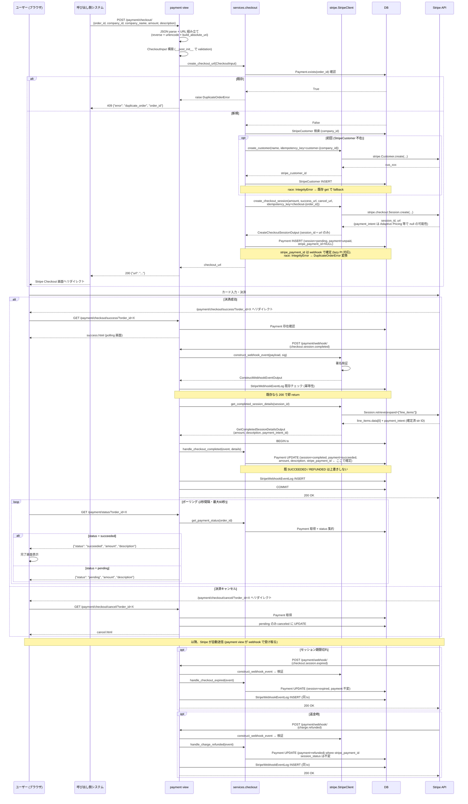
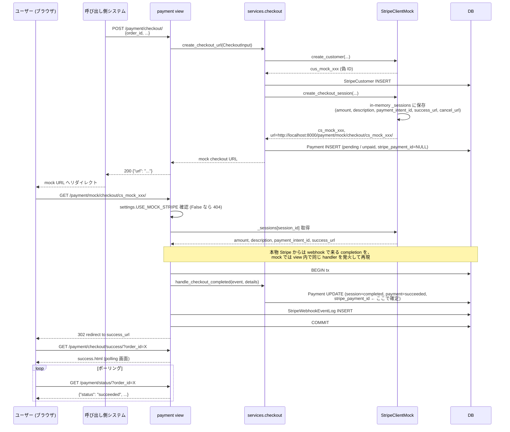
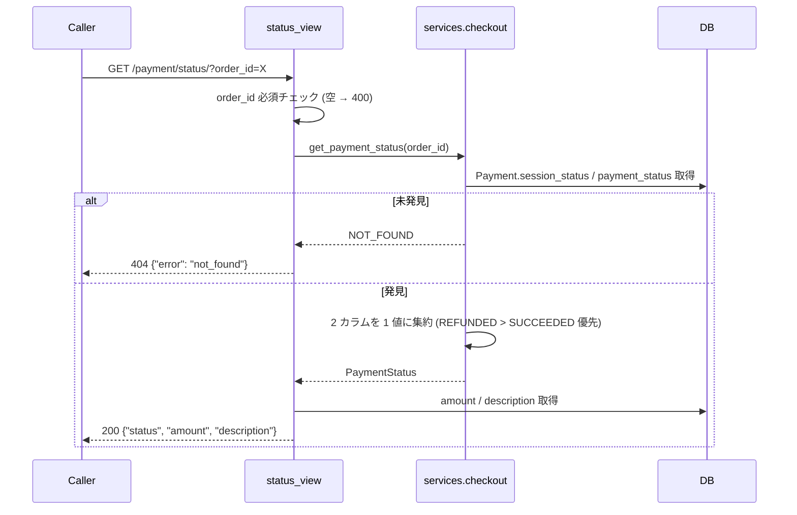

# Stripe 決済フロー

## 1. 自由金額決済 (本番モード `USE_MOCK_STRIPE=false`)

---

## 2. Mock モード (`USE_MOCK_STRIPE=true`)

stripe-cli が使えない開発者向け。Stripe API を一切叩かず in-memory mock で同等動作する。
Service / view 層は mock 非依存 (mock 知識は `stripe/client_mock.py` と `mock_checkout_view` のみに閉じる)。

---

## 3. 結果取得 (status_view)

