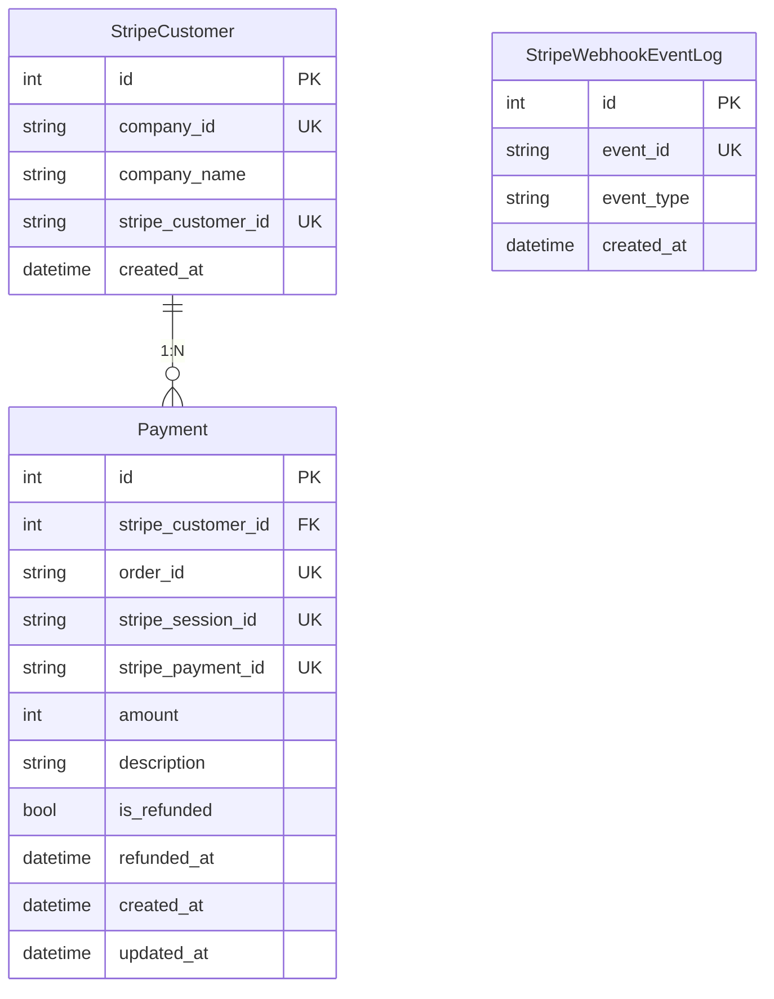

# 決済機能 ER図

Payment は「決済成功した事実」のみを記録する。
pending / canceled / expired は DB に保持せず、Stripe 側に任せる。

```mermaid
erDiagram
    StripeCustomer ||--o{ Payment : "1:N"

    StripeCustomer {
        int id PK
        string company_id UK
        string company_name
        string stripe_customer_id UK
        datetime created_at
    }

    Payment {
        int id PK
        int stripe_customer_id FK
        string order_id UK
        string stripe_session_id UK
        string stripe_payment_id UK
        int amount
        string description
        bool is_refunded
        datetime refunded_at
        datetime created_at
        datetime updated_at
    }

    StripeWebhookEventLog {
        int id PK
        string event_id UK
        string event_type
        datetime created_at
    }
```
