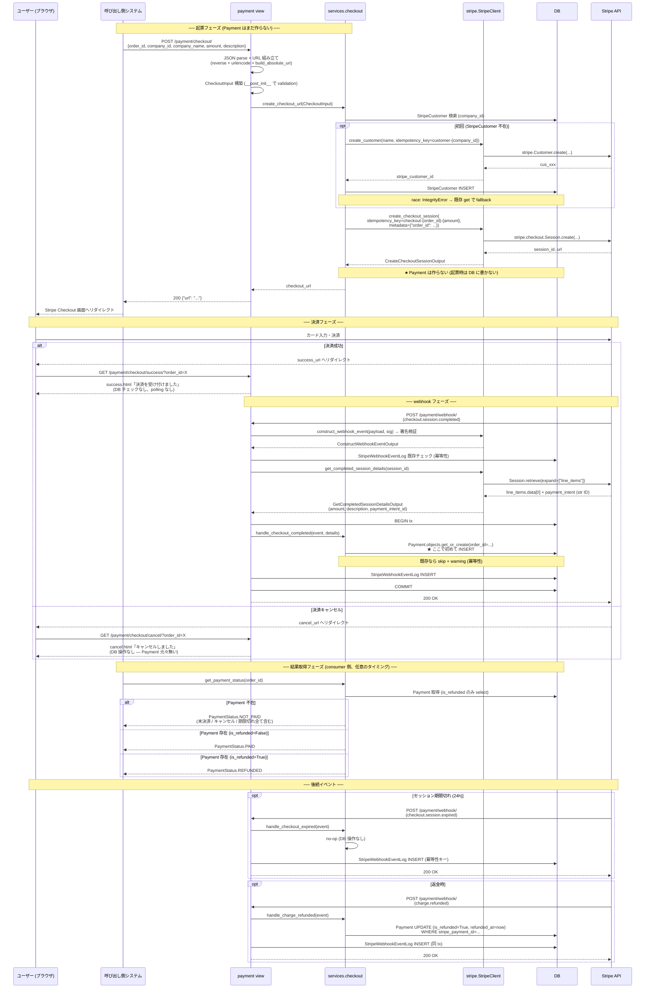
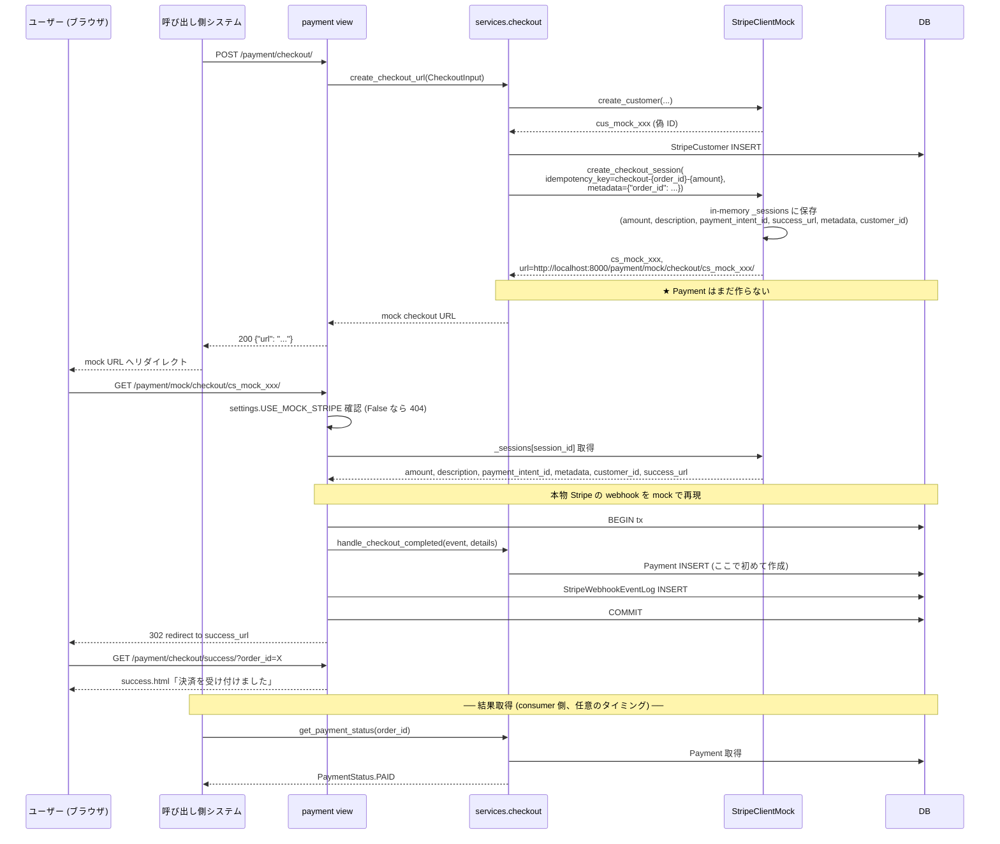

# Stripe 決済フロー

## 設計の核心思想
```
「Stripe が状態の真実、DB は成功記録のキャッシュ」
```

## 1. 自由金額決済 (本番モード `USE_MOCK_STRIPE=false`)



---

## 2. Mock モード (`USE_MOCK_STRIPE=true`)

stripe-cli が使えない開発者向け。Stripe API を一切叩かず in-memory mock で同等動作。
Service / view 層は mock 非依存 (mock 知識は `stripe/client_mock.py` と `mock_checkout_view` のみに閉じる)。


